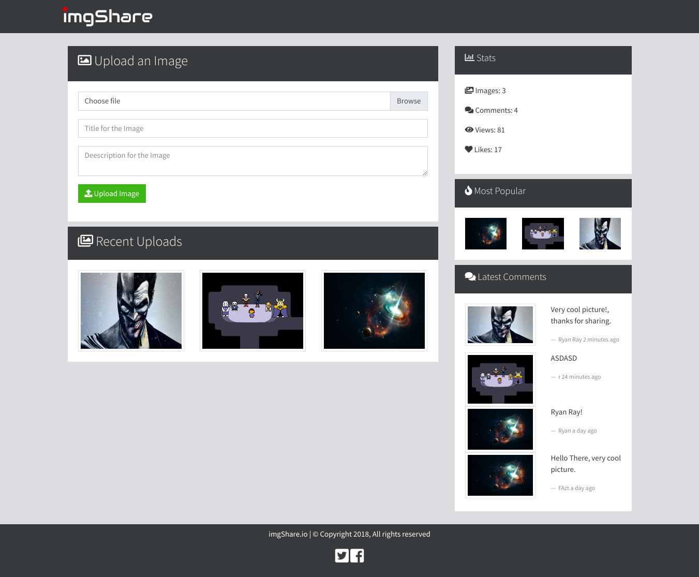

# NODEJS - EXPRESS - MONGODB


## SOCIAL NETWORK 🚀


### Pre-requisitos 📋


* ANDROID STUDIO
* JAVA SDK
* FLUTTER
* LIBRARY 1: cupertino_icons: ^0.1.3
* LIBRARY 2: speech_to_text: ^2.3.0
* LIBRARY 3: highlight_text: ^0.7.2
* LIBRARY 4: avatar_glow: ^1.2.0


### Instalación 🔧


# Environment Variables
* `MONGODB_URI`, the mongodb database uri
* `PORT` the http server port. By default is `3000`

# Installation
```
git clone https://github.com/FaztTech/nodejs-imgshare
cd nodejs-imagshare
npm install 
npm start
```

# Docker
```
docker-compose build
```
```
docker-compose up
```


## Autores ✒️

* **Diego Bermúdez**


## Licencia 📄

Este proyecto está bajo la Licencia (Tu Licencia) - mira el archivo [LICENSE.md](LICENSE.md) para detalles

## Expresiones de Gratitud 🎁

* Comenta a otros sobre este proyecto 📢
* Invita una cerveza 🍺 o un café ☕ a alguien del equipo. 
* Da las gracias públicamente 🤓.
* etc.


---
⌨️ con ❤️ por [DiegoBermudez](https://github.com/aadiegoaa96) 😊


imgShare is a web application to share images, comments, and more.



# Improvements for the Future
- Input Validation (to avoid XSS)
- User Authentication
